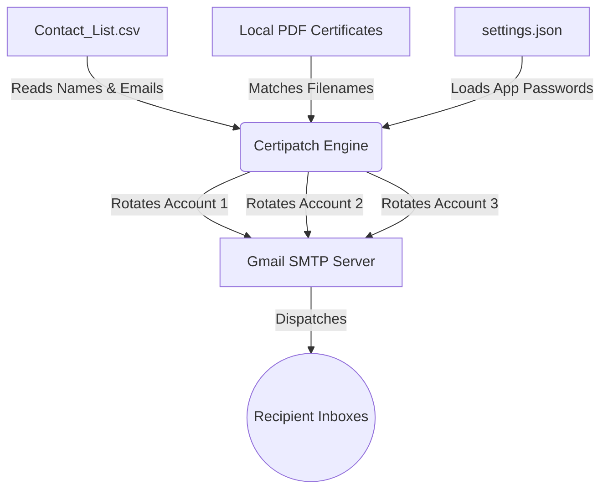

# 🚀 Certipatch

Certipatch is a lightweight, high-performance Python utility designed to bulk-dispatch personalized emails with local file attachments.

It was built specifically to solve the limitations of free email tiers by utilizing **Round-Robin Account Rotation**, allowing organizations to send thousands of emails seamlessly and legally.

## 🎯 The Problem We Are Solving

When hosting a large event, hackathon, or university course, sending out thousands of certificates or credentials is a massive bottleneck:

1. **The Rate Limit**: Free Gmail accounts are capped at 500 emails per 24 hours. Sending 5,000 certificates from one account would take 10 days.
2. **The Attachment Nightmare**: Manually matching thousands of PDF files to recipients is highly error-prone.
3. **The Spam Filter**: Bulk sending triggers spam filters and can lead to account bans.

### ✅ Certipatch solves this by:
- Rotating through multiple sender accounts (e.g., 4 accounts = 2,000 emails/day)
- Dynamically mapping CSV data to local file paths
- Injecting human-like time delays to reduce spam detection

## ✨ Features

- **📄 Dynamic CSV Parsing** – Maps names, emails, and file paths automatically
- **📎 Local File Attachment** – No cloud storage needed
- **🔄 Smart Account Rotation** – Load is distributed across multiple accounts
- **🔒 Secure Connection** – Uses SSL + Google App Passwords
- **🪶 Zero Dependencies** – Pure Python (no `pip install` required)

## 🧠 How It Works



## 🛠️ Step-by-Step Setup Guide

> ⚠️ **Important Security Note:**
> The `config/` and `data/` folders are intentionally ignored by Git. You must recreate them locally.

### Step 1: Clone the Repository
```bash
git clone https://github.com/SudiptaSanki/Certipatch.git
cd Certipatch
```

### Step 2: Recreate the Directory Structure
```bash
mkdir config
mkdir data
mkdir data/certificates    
```

**Expected structure:**
```text
Certipatch/
├── config/
├── core/
├── data/
│   └── certificates/
├── scripts/
└── README.md
```

### Step 3: Configure Your Sending Accounts

You must use a **Google App Password** (not your normal password).

1. Go to Google Account → Security → 2-Step Verification
2. Generate an App Password

Create `config/settings.json`:
```json
{
  "accounts": [
    {
      "email": "your.project.email1@gmail.com",
      "password": "your16letterpasswordhere"
    },
    {
      "email": "your.project.email2@gmail.com",
      "password": "another16letterpassword"
    }
  ],
  "email_settings": {
    "subject": "Your Event Certificate",
    "body_template": "Hello {name},\n\nThank you for participating! Your certificate is attached below.\n\nBest regards,\nThe Team"
  }
}
```

> 💡 **Tip:** You can add unlimited accounts — Certipatch will rotate automatically.

### Step 4: Prepare Your Data

Create `data/Contact_List.csv`:
```csv
Name,Email,Certificate_File
John Doe,johndoe@example.com,john_doe_cert.pdf
Alex Smith,jane@example.com,jane_smith_cert.pdf
```

Place all certificate PDFs inside: `data/certificates/`

## 🚀 Usage Guide

Run the script from the root directory:
```bash
python scripts/cli_sender.py
```

### 📤 Expected Output
```text
=== Certipatch Engine Initializing ===
[OK] Loaded 2 sending accounts.
Starting dispatch...

Sending to johndoe@example.com (via your.project.email1@gmail.com)...
[+] Success: John Doe
Sending to jane@example.com (via your.project.email2@gmail.com)...
[+] Success: Jane Smith

=== Dispatch Complete ===
Successfully sent: 2 | Failed: 0
```

## ⚠️ Troubleshooting

- **❌ Authentication Failed**
  - App Password is incorrect
  - Contains spaces
  - 2-Step Verification is disabled
- **❌ Attachment Not Found**
  - Check file names carefully
  - Ensure extensions aren’t duplicated (`.pdf.pdf`)
- **❌ CSV Format Error**
  - Headers must be exactly: `Name, Email, Certificate_File`
  - Case-sensitive

## 🧩 Final Notes

Certipatch is designed for speed, simplicity, and reliability — perfect for:
- Hackathons
- University programs
- Certification distribution
- Bulk email automation

---
*Note: This is the first version of the repository. The next version will come soon!*