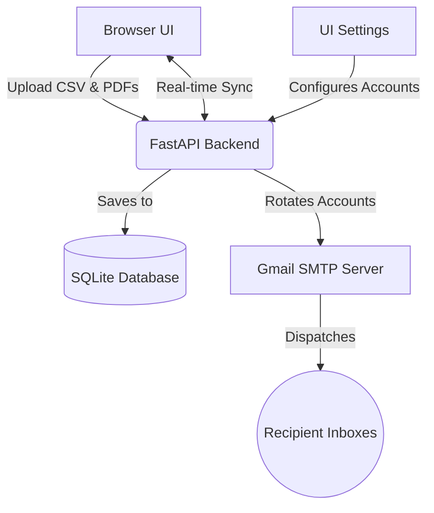

<div align="center">

# 🚀Certipatch (Version 3)

[](https://fastapi.tiangolo.com)
[](https://www.python.org/)
[](https://www.sqlite.org/)
[](https://opensource.org/licenses/MIT)

</div>

Certipatch is a lightweight, high-performance Python utility designed to bulk-dispatch personalized emails with local file attachments.

It was built specifically to solve the limitations of free email tiers by utilizing **Round-Robin Account Rotation**, allowing organizations to send thousands of emails seamlessly and legally.

## 🌟 What's New in Version 3

Version 3 brings a massive overhaul to the architecture, turning Certipatch from a simple script into a full-fledged web application:

- **Beautiful UI Dashboard**: A completely redesigned, modern front-end application separated from the backend.
- **In-Browser File Uploads**: Drag and drop your CSV contact list and PDF certificates directly in the browser!
- **Auto-Matching & Preview**: The system automatically matches PDF filenames to your CSV data (using fuzzy matching) and lets you preview exactly who gets what before sending.
- **Dynamic Account Management**: Add, remove, and manage your sender accounts (and their App Passwords) directly from the UI. No more editing JSON files manually.
- **Configurable Quotas**: V3 restores full rolling-window quota tracking (default 500/day) with a real-time Quota Left card in the dashboard.
- **Test Sending**: Send a test email to yourself to verify templates before launching the bulk dispatch.
- **Selective Cleanup**: New "Clear Completed" button allows you to clear out successful and failed sends while keeping the pending ones intact.

## 🎯 The Problem We Are Solving

When hosting a large event, hackathon, or university course, sending out thousands of certificates or credentials is a massive bottleneck:

1. **The Rate Limit**: Free Gmail accounts are capped at 500 emails per 24 hours. Sending 5,000 certificates from one account would take 10 days.
2. **The Attachment Nightmare**: Manually matching thousands of PDF files to recipients is highly error-prone.
3. **The Spam Filter**: Bulk sending triggers spam filters and can lead to account bans.

### ✅ Certipatch solves this by:
- Rotating through multiple sender accounts (e.g., 4 accounts = 2,000 emails/day)
- Dynamically mapping CSV data to uploaded file paths
- Injecting human-like time delays to reduce spam detection

## 🧠 How It Works



## 🛠️ Step-by-Step Usage Guide

### Step 1: Clone & Setup
```bash
git clone https://github.com/SudiptaSanki/Certipatch.git
cd Certipatch
```

### Step 2: Start the Server
Simply double-click the **`Run.bat`** file.
The batch file will automatically:
1. Detect your Python installation.
2. Install any missing dependencies (`fastapi`, `uvicorn`, `sqlalchemy`, `python-multipart`, `openpyxl`).
3. Start the server on port 8002.
4. Open the beautiful Web Dashboard in your default browser.

*(Note: V2 uses port 8001, and V3 uses port 8002 so you can run both simultaneously if needed!)*

### Step 3: Configure Settings (via Browser)
1. Go to the **Settings** tab in the dashboard.
2. Enter your Email Subject and Body Template.
3. Add your sender accounts. 
   > **Note:** You must use a **16-letter Google App Password** (not your normal password). You can find instructions on how to generate one directly in the dashboard UI!

### Step 4: Upload Data (via Browser)
1. Go to the **Upload Data** tab.
2. **Upload Contacts:** Drag and drop your Excel (.xlsx) or CSV file containing your participants. The system will auto-detect Name, Email, and Filename columns.
3. **Upload Certificates:** Drag and drop all your generated PDF certificates.
4. Certipatch will automatically match the files to the contacts and show you a preview table.

### Step 5: Send!
1. Go to the **Dashboard** tab.
2. Optionally click **"Send Test to Myself"** to verify your email template looks good.
3. Click **"Launch Bulk Send"**.
4. Watch the real-time progress as emails are dispatched, tracking Pending, Sent, Failed, and your Remaining Quota.

## 🛡️ Security Note

All database files (`*.db`), uploaded certificates (`*.pdf`), uploaded contacts (`*.csv`), and configuration secrets (`*settings*.json`) are **ignored by Git** for your safety. Your app passwords and email lists will never be accidentally committed to GitHub.

## 🤝 Contributors
- **SudiptaSanki** - Core Developer & Maintainer
I would love your contribution feel free to contact I would love to work and make it bigger.

---
*Release v3.0.0*
