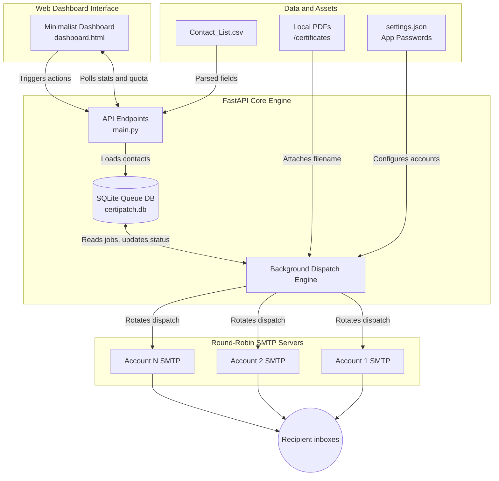

<div align="center">
  <h1>🚀 Certipatch v2.0</h1>
  <p><b>A High-Performance Bulk Email Dispatcher with Smart Round-Robin Account Rotation & a Beautiful Web Dashboard.</b></p>
  
  [](https://fastapi.tiangolo.com)
  [](https://www.python.org/)
  [](https://www.sqlite.org/)
  [](https://opensource.org/licenses/MIT)
</div>

---

## 🌟 Overview

When hosting massive events, hackathons, or educational bootcamps, manually emailing thousands of certificates to recipients is plagued with bottlenecks:
1. **Strict Rate Limits:** Free tier email accounts (like Gmail) cap dispatches at **500 emails per rolling 24 hours**. Sending 5,000 certificates from one account would take 10 full days!
2. **Attachment Nightmares:** Manually matching individual local PDF files to recipients is highly tedious and error-prone.
3. **Spam Flagging:** Mass dispatching without delays triggers heuristic spam filters.

### ✨ The Certipatch Solution
Certipatch completely resolves these pain points by combining a **highly polished, minimal web dashboard** with an advanced backend queue engine that executes **Intelligent Round-Robin Sender Rotation**. By pooling multiple sender accounts together (e.g., 4 accounts = 2,000 emails/day), it automatically distributes the load, maps local attachments natively, applies human-like dispatch delays, and gives you complete real-time tracking over your quota and queues.

---

## 🎨 Key Features

- **🖥️ Beautiful Minimalist Dashboard** – Live tracking of sent/pending/failed dispatches, quota left, and complete dispatch overviews at a single glance.
- **🔄 Smart Account Rotation** – Dynamically alternates between unlimited pre-configured sender email accounts to multiply your daily sending capacity legally.
- **📊 Real-Time Rolling Quota Tracker** – Automatically calculates remaining limits based on your loaded accounts and successfully dispatched jobs today.
- **📁 Secure Local File Attachments** – Attaches files natively from your filesystem. Zero external cloud buckets or public link hosting required.
- **⚙️ Background Task Processing** – Dispatches smoothly in background threads with integrated pause/resume capabilities directly from the UI.
- **🛡️ Bulletproof Delivery** – Connects securely via SSL using Google App Passwords.

---

## 🧠 System Architecture Diagram



---

## 🛠️ Step-by-Step Setup Guide

> [!IMPORTANT]
> The `backend/config/` and `backend/data/` directories contain sensitive user information and files, so they are intentionally excluded from version control. Follow the setup below to properly instantiate them locally.

### Step 1: Clone the Repository
Simply click the copy button on the codeblock below to execute the clone command in your terminal:

```bash
git clone https://github.com/SudiptaSanki/Certipatch.git
cd Certipatch
```

### Step 2: Set Up Directory Structure & Install Dependencies
Ensure you have Python installed. Navigate to the local directory and install the necessary lightweight packages:

```bash
# Create required data directory
mkdir backend/data

# Install core runtime dependencies
pip install fastapi uvicorn sqlalchemy
```

### Step 3: Configure Sender Accounts
Certipatch requires secure authentication via **Google App Passwords** (standard account passwords will not work).
1. Navigate to your Google Account Settings → **Security** → Enable **2-Step Verification**.
2. Go to **App Passwords** and generate a custom 16-character code.

Create a new file located precisely at `backend/config/settings.json` and populate it with your multiple sender credentials:

```json
{
  "accounts": [
    {
      "email": "your.primary.account@gmail.com",
      "password": "your16charpasswordnospaces"
    },
    {
      "email": "your.secondary.account@gmail.com",
      "password": "anotherpasswordnospaces"
    }
  ],
  "email_settings": {
    "subject": "🎉 Your Official Event Certificate",
    "body_template": "Hello {name},\n\nThank you for participating in our event! Please find your official personalized certificate attached below.\n\nBest regards,\nThe Automation Team"
  }
}
```

> [!TIP]
> **Password formatting:** Always remove spaces from your Google App Passwords inside `settings.json` to prevent authentication handshake errors. You can add as many sender accounts as you need into the JSON array!

### Step 4: Populate Data & Attachments
1. Place your list of contacts inside `backend/data/Contact_List.csv` ensuring case-sensitive column headers match exactly:
```csv
Name,Email,Certificate_File
Alice Smith,alice@example.com,cert_alice.pdf
Bob Jones,bob@example.com,cert_bob.pdf
```
2. Drop all corresponding attachment files directly inside `backend/data/certificates/`.

---

## 🚀 Running the Application

### On Windows (Recommended QuickStart)
We provide a convenient pre-configured launcher script. Simply double-click:
```text
Run.bat
```
This automatically boots up the internal FastAPI server, waits briefly for background threads to stabilize, and instantly opens your default web browser directly into the beautiful **Certipatch Control Dashboard** (`http://127.0.0.1:8000/`).

### On macOS / Linux / Custom Terminals
Navigate to the root directory and start the production standard Uvicorn server:
```bash
cd backend
python -m uvicorn api.main:app --port 8000 --reload
```
Open your preferred browser and visit: [http://127.0.0.1:8000/](http://127.0.0.1:8000/)

---

## 🕹️ Dashboard Usage Guide

Once the simple UI opens up:
1. **Load CSV:** Click the `Load CSV` button at the top right. This scans your local `Contact_List.csv` file and injects all valid new recipients securely into the native SQLite database queue.
2. **Start Engine:** Click `Start Engine` to initiate the background round-robin dispatcher. The top engine status dot will begin smoothly pulsing green.
3. **Real-time Metrics:** Watch your **Emails Sent**, **Pending Jobs**, **Failed Attempts**, and live **Rolling Quota Left** update seamlessly in real time.
4. **Recent Jobs Overview:** Review dispatches cleanly organized in the table grid, highlighting recipient specifics, custom attachment matches, and the exact rotation account utilized for transparency.
5. **Pause:** At any moment, click `Pause` to cleanly suspend dispatches after the current queued transaction finishes.

---

## ⚠️ Troubleshooting Guide

| Symptom | Root Cause | Solution |
| :--- | :--- | :--- |
| **❌ Authentication Failed** | Incorrect App Password formatting. | Ensure spaces are completely removed from your 16-character App Password inside `settings.json`. Make sure 2-Step verification remains fully active. |
| **❌ Attachment Not Found** | Case sensitivity or extension duplication. | Ensure your CSV `Certificate_File` strings perfectly match local basenames (e.g., avoid accidental `.pdf.pdf` appends). |
| **❌ CSV Import Fails** | Header spelling errors. | Ensure your top header columns are spelled exactly: `Name,Email,Certificate_File`. |
| **❌ Database Locked** | Concurrent process blocks. | Close duplicate terminal instances running the backend server simultaneously. |

---

## 📜 License

This project is licensed under the **MIT License**. Feel free to fork, expand, and distribute freely! Made with ❤️ for developers, event organizers, and educators worldwide.